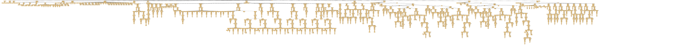

# nmodl.js - NEURON Simulator in JavaScript

## Overview

[nmodl.js](https://github.com/vahidgh/nmodljs) is a project aimed at providing a [NEURON simulator](http://neuron.yale.edu/neuron/)  implemented in JavaScript. This project leverages the capabilities of JavaScript to create a flexible and interactive environment for simulating neuronal models defined using the NEURON Model Description Language ([NMODL](https://www.neuron.yale.edu/neuron/static/docs/help/neuron/nmodl/nmodl.html)). 

With nmodl.js, developers can utilize modern web technologies to run simulations directly in the browser, enabling real-time visualization and manipulation of neuronal models.

## Features

- **Browser-Based Simulation**: Run NEURON simulations directly in your web browser without the need for additional software installations.
- **Interactive Visualization**: Utilize JavaScript libraries for dynamic visualization of neuronal activity and model parameters.
- **Integration with Web Technologies**: Easily integrate with other JavaScript libraries and frameworks to enhance functionality and user experience.
- **Support for NMODL**: Parse and execute NMODL code using the ANTLR4 grammar for accurate model representation.

## Installation

To get started with nmodl.js, follow these steps:

1. **Clone the Repository**: Clone the repository containing the nmodl.js files.

   ```bash
   git clone https://github.com/vahidgh/nmodljs.git
   cd nmodljs
   ```

2. **Install Dependencies**: Install the required dependencies using npm.
   
    ```bash
    npm install
    ```

3. **Run the Simulator**: Start the development server to run the simulator.

    ```bash
    npm start
    ```


## ANTLR4 Grammar for NMODL

[NMODL](https://www.neuron.yale.edu/neuron/static/docs/help/neuron/nmodl/nmodl.html) (NEURON Model Description Language) is a domain-specific language used to define models for the [NEURON simulator](http://neuron.yale.edu/neuron/). This ANTLR4 grammar provides a formal specification for parsing NMODL code, enabling syntax highlighting, code analysis, and other tooling for developers working with NEURON.


## Run and test grammar

To run and test NMODL grammar with ANTLR4, follow these steps:

### Option 1: Using Antlr4 Java Runtime

1. **Install ANTLR4**: Ensure you have ANTLR4 installed. You can download it from [ANTLR's official website](https://www.antlr.org/download.html).

2. **Generate the Parser**: Use ANTLR4 to generate the parser and lexer from the grammar file.

   ```
   cd src/grammar
   antlr4 nmodl.g4
   ```

3. **Test**: Use `src/grammar/rule_test.sh` to test `.mod` files in the `examples` directory.
   Make sure you have the `antlr` `jar` file in the `dev/g4-output` directory.

   ```
   bash rule_test.sh
   ```
   Or
   ```
   cat examples/isi.mod | bash rule_test.sh
   ```

   An output like this can be seen:

   <div 
      style="overflow-x: auto; border: 1px solid #ccc;" 
      onclick="window.open(['https://raw.githubusercontent.com/VahidGh/nmodljs/refs/heads/master/antlr4_parse_tree_isi.svg', '_blank');"
   >
      
   </div>


### Option 2: Using Antlr4ts TypeScript Parser Generator

1. **Install ANTLR4ts**: 
   ```
   npm install antlr4ts
   ```

2. **Generate the Parser**: 

   ```
   cd src/grammar
   antlr4ts nmodl.g4
   ```

3. **Test**: Uder development...
   
## Contributing

Contributions are welcome! If you find any issues or have suggestions for improvements, please open an issue or submit a pull request.

## License

This project is licensed under the MIT License. See the [LICENSE](https://github.com/vahidgh/nmodljs/LICENSE) file for details.

## Acknowledgments

NEURON Simulator: https://neuron.yale.edu/neuron/

ANTLR: https://www.antlr.org/